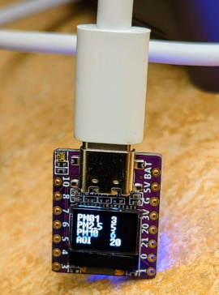

# Small Dust Sensor Display

I bought a very small SoC board, an ESP32-C3 with a tiny 0.42 inch SSD1306 72x48 pixel display, a
QWIC/Stemma type 4-pin connector, USB-C power/serial/programming, and
a Neopixel-like LED.

The LED was a painfully bright blue from the start, so I brought in the
Adafruit NeoPixel library to cut it back, using the Adafruit blink
example to start with, and also to give a Green-Yellow-Red range for PM 2.5 values. Green < 5, Yellow < 20, Red > 20. 

I used the manufacturer-recommended 01Space Graphics Test sketch to start, then once I'd settled issues and gotten a working environment, I moved to the examples below and connected to my own internal MQTT server.

# Provenance
Cobbled together from these examples:
- https://github.com/01Space/ESP32-C3-0.42LCD
- https://github.com/survivingwithandroid/ESP32-MQTT

# Issues Overcome
- Set CDC on Boot in Arduino IDE Menu to make Serial.print work
- Direct USB-C cable to Linux desktop worked best
- Multiple copies of u8g2 and u8g2_arduino installed with different fonts
- As always, string parsing in C
- Can't find a font size that supports more than four key-value lines on LCD

# Issues not yet overcome
- style and utility
- can we read the B button for UI

# References
- https://www.banggood.com/ESP32-C3-0_42-inch-LCD-Development-Board-RISC-V-WiFi-Bluetooth-Arduino-or-Micropython-p-1947665.html
- https://github.com/01Space/ESP32-C3-0.42LCD
- https://www.electronics-lab.com/getting-started-with-espressifs-esp32-c3-devkitm-1-on-arduino-ide/
- https://www.cnx-software.com/2022/05/17/esp32-c3-0-42lcd-is-a-tiny-wifi-ble-iot-board-with-0-42-inch-display-qwiic-connector/
- https://espressif-docs.readthedocs-hosted.com/projects/arduino-esp32/en/latest/boards/ESP32-C3-DevKitM-1.html
- https://learn.adafruit.com/adafruit-qt-py-esp32-c3-wifi-dev-board/arduino-neopixel-blink
- https://github.com/survivingwithandroid/ESP32-MQTT/
- https://www.survivingwithandroid.com/getting-started-with-esp32-build-a-weather-station/
- https://github.com/platformio/platform-espressif32/issues/591 
- https://github.com/olikraus/u8g2/wiki/u8g2reference
- https://www.best-microcontroller-projects.com/ssd1306.html
- https://github.com/olikraus/u8g2/wiki/fntlist8
